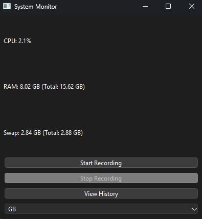
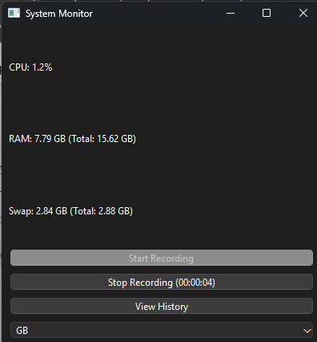
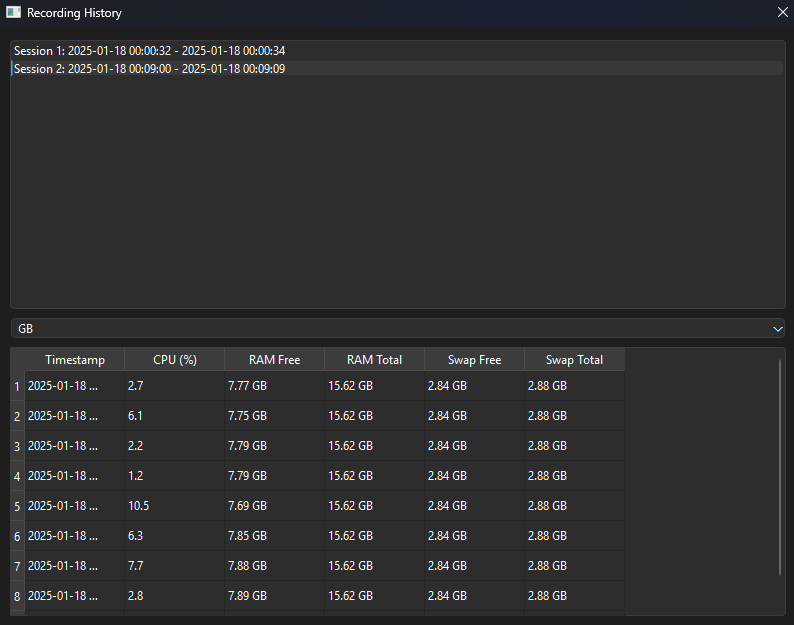

# Desktop Application for Monitoring System Metrics

## Описание
Это приложение предназначено для мониторинга и отображения системных метрик в реальном времени, таких как использование CPU, RAM и диска на Linux-машине. Оно позволяет пользователям записывать эти данные в базу данных и просматривать историю записей через интуитивно понятный интерфейс.

## Description
This application is designed to monitor and display real-time system metrics such as CPU, RAM, and Disk usage on a Linux machine. It allows users to record this data into a database and view the recording history through an intuitive interface.

## Features / Особенности
1. **Real-Time Monitoring / Мониторинг в реальном времени:**
   - Displays CPU, RAM, and Disk usage. / Отображает использование CPU, RAM и диска.
   - Updates metrics at a customizable interval (minimum 1 second). / Обновляет метрики с настраиваемым интервалом (минимум 1 секунда).

2. **Recording Functionality / Функциональность записи:**
   - Start recording system metrics into a database by clicking the "Start Recording" button. / Начните запись системных метрик в базу данных, нажав кнопку "Начать запись".
   - Switch to a "Stop Recording" button with a timer showing the recording duration. / Переключитесь на кнопку "Остановить запись" с таймером, показывающим продолжительность записи.
   - Stop recording and reset the timer by clicking the "Stop Recording" button. / Остановите запись и сбросьте таймер, нажав кнопку "Остановить запись".

3. **History View / Просмотр истории:**
   - View all previously recorded data in a separate table window. / Просмотр всех ранее записанных данных в отдельном окне таблицы.

4. **Cross-Platform Support / Кроссплатформенная поддержка:**
   - Works on Linux systems. / Работает на системах Linux.

5. **Testing / Тестирование:**
   - Full test coverage with automated unit tests. / Полное покрытие тестами с автоматизированными юнит-тестами.

6. **Continuous Integration (CI) / Непрерывная интеграция (CI):**
   - GitHub Actions for running tests automatically on each push to the repository. / GitHub Actions для автоматического запуска тестов при каждом пуше в репозиторий.

## Screenshots / Скриншоты
### Main Window / Главное окно


### Recording in Progress / Запись в процессе


### History View / Просмотр истории


## Installation / Установка
### Prerequisites / Предварительные требования
- Python 3.12 or higher / Python 3.12 или выше
- Operating system: Windows, Linux, or macOS / Операционная система: Windows, Linux или macOS

### Setup on Windows / Настройка на Windows
1. Download and install Python 3.12 from [python.org](https://www.python.org/downloads/).
2. Clone the repository:
   ```bash
   git clone https://github.com/Arm1700/Desktop-App.git
   cd Desktop-App
   ```
3. Create and activate a virtual environment:
   ```bash
   python -m venv venv
   venv\Scripts\activate
   ```
4. Install dependencies:
   ```bash
   pip install -r requirements.txt
   ```

### Setup on Linux/Mac OS / Настройка на Linux/Mac OS
1. Install Python 3.12 using your package manager (e.g., `brew install python` on macOS, `sudo apt-get install python3.12` on Ubuntu).
2. Clone the repository:
   ```bash
   git clone https://github.com/Arm1700/Desktop-App.git
   cd Desktop-App
   ```
3. Create and activate a virtual environment:
   ```bash
   python3 -m venv venv
   source venv/bin/activate
   ```
4. Install dependencies:
   ```bash
   pip install -r requirements.txt
   ```

## Project Structure / Структура проекта

```
your_project/
│
├── src/
│   ├── main.py                # Main application file / Главный файл приложения
│   ├── ... (other source files) / ... (другие исходные файлы)
│
├── tests/
│   ├── test_system_monitor.py  # Tests for the SystemMonitor class / Тесты для класса SystemMonitor
│   ├── test_history_window.py   # Tests for the HistoryWindow class / Тесты для класса HistoryWindow
│   └── ... (other test files) / ... (другие тестовые файлы)
│
├── screenshots/               # Directory for application screenshots / Директория для скриншотов приложения
│   ├── main_window.png        # Screenshot of the main window / Скриншот главного окна
│   ├── recording_in_progress.png # Screenshot of recording in progress / Скриншот записи в процессе
│   └── history_view.png       # Screenshot of the history view / Скриншот просмотра истории
│
├── .coveragerc                # Configuration file for coverage reports / Файл конфигурации для отчетов о покрытии
├── requirements.txt           # List of project dependencies / Список зависимостей проекта
└── README.md                  # Project documentation / Документация проекта
```

## Function Overview / Обзор функций

- **main()**: Entry point of the application that initializes and starts the monitoring process. / Точка входа в приложение, которая инициализирует и запускает процесс мониторинга.
- **SystemMonitor**: Class that handles the main functionality of the application, including monitoring system metrics, recording data, and managing the user interface. / Класс, который обрабатывает основную функциональность приложения, включая мониторинг системных метрик, запись данных и управление пользовательским интерфейсом.
- **HistoryWindow**: Class that displays the history of recorded metrics. / Класс, который отображает историю записанных метрик.
- **start_recording()**: Initiates the recording of metrics into the database. / Инициализирует запись метрик в базу данных.
- **stop_recording()**: Stops the recording process and saves the data. / Останавливает процесс записи и сохраняет данные.
- **view_history()**: Displays previously recorded metrics in the history view. / Отображает ранее записанные метрики в просмотре истории.

## Running the Application / Запуск приложения

### On Windows / На Windows
1. Start the application by running: / Запустите приложение, выполнив:
   ```bash
   python src/main.py
   ```
2. Use the interface to monitor system metrics and manage recordings. / Используйте интерфейс для мониторинга системных метрик и управления записями.

### On Linux/Mac OS / На Linux/Mac OS
1. Start the application by running: / Запустите приложение, выполнив:
   ```bash
   python3 src/main.py
   ```
2. Use the interface to monitor system metrics and manage recordings. / Используйте интерфейс для мониторинга системных метрик и управления записями.

## Running Tests / Запуск тестов
To run tests and check code coverage: / Чтобы запустить тесты и проверить покрытие кода:
```bash
pytest --cov=.
```
Example output: / Пример вывода:
```
----------- coverage: 100% ----------- 
...
```

## Time Spent / Время затрачено
Time spent on completing this project: **[3.5 hours]** / Время, затраченное на завершение этого проекта: **[3.5 hours]**


## Resume / Резюме
[(https://github.com/user-attachments/files/18462629/Arman.Beglaryan.CV.pdf)] / [(https://github.com/user-attachments/files/18462629/Arman.Beglaryan.CV.pdf)]

---
